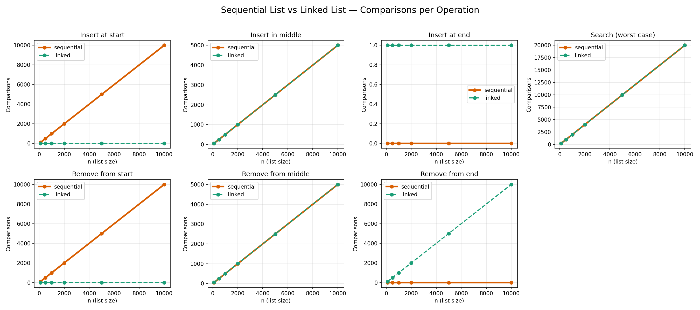

# Sequential List vs Linked List — C++ Benchmark

A hands-on comparison between two classic data structure implementations in C++ — an **array-based sequential list** and a **singly linked list** — both storing simple `Person` records (name + numeric ID). Each operation is instrumented to count **comparisons** and **movements**, and the project includes an automated benchmark with a comparison chart.

## Repository structure

```
.
├── sequential-list/
│   └── sequential_list.cpp   # Interactive CLI, array-based implementation
├── linked-list/
│   └── linked_list.cpp       # Interactive CLI, pointer-based implementation
├── benchmark/
│   ├── benchmark_sequential.cpp  # Non-interactive cost measurement (sequential)
│   ├── benchmark_linked.cpp      # Non-interactive cost measurement (linked)
│   ├── plot_results.py           # Generates the comparison chart from results.csv
│   ├── run_benchmark.sh          # Compiles, runs and plots everything in one step
│   └── results.csv               # Latest benchmark output
└── assets/
    └── comparison_chart.png      # Generated chart (see below)
```

## The two implementations

### Sequential list (`sequential-list/`)
A fixed-size array (`MAX_PEOPLE = 50`). Insertion and removal require shifting elements, so most operations cost `O(n)` in the worst case, but there's no per-node allocation overhead and iteration is cache-friendly.

### Linked list (`linked-list/`)
Dynamically allocated nodes (`struct Node`) connected via `next` pointers, with `head` and `tail` references. Insertion/removal at the start is `O(1)`; insertion/removal in the middle still requires traversal (`O(n)`). Because it's a **singly** linked list (no `prev` pointer), removing from the end also requires a full traversal — an interesting trade-off that shows up clearly in the benchmark below.

Both versions support:
- Insert at start / middle / end
- Remove from start / middle / end
- Search by ID
- Show list
- Save/load from a text file
- Per-operation counters for comparisons `C(n)` and movements `M(n)`, plus wall-clock time

## Benchmark results

The benchmark builds lists of increasing size (100 to 10,000 elements) and measures the comparison count for each operation. Run it yourself with:

```bash
cd benchmark
./run_benchmark.sh
```



**What the chart shows:**
- **Insert/remove at start**: the sequential list is `O(n)` (has to shift every element), the linked list is `O(1)` (constant, near zero).
- **Insert/remove in the middle**: both are `O(n)` — the sequential list shifts elements, the linked list traverses pointers — and the cost is nearly identical.
- **Insert at end**: the linked list is `O(1)` thanks to the `tail` pointer; the sequential list is also `O(1)` here since appending just means writing at `size`.
- **Remove from end**: the sequential list is `O(1)` (just decrement `size`), but the linked list is `O(n)` — since it only keeps a `next` pointer, it has to walk the whole list to find the node *before* the last one.
- **Search (worst case)**: identical cost for both, since neither structure supports faster-than-linear search on an unsorted list.

This last point (remove from end) is a good illustration of why a **doubly** linked list is often preferred in practice when frequent end-removal is needed.

## How to compile and run the interactive programs

```bash
# Sequential list
g++ -O2 -o sequential_list sequential-list/sequential_list.cpp
./sequential_list

# Linked list
g++ -O2 -o linked_list linked-list/linked_list.cpp
./linked_list
```

Both read/write their data from a local `IdName10.txt` file in the working directory.

## Why this project

Built as a study project for a Data Structures course, then cleaned up to make the trade-offs between contiguous and pointer-based storage visible and measurable rather than just theoretical.
